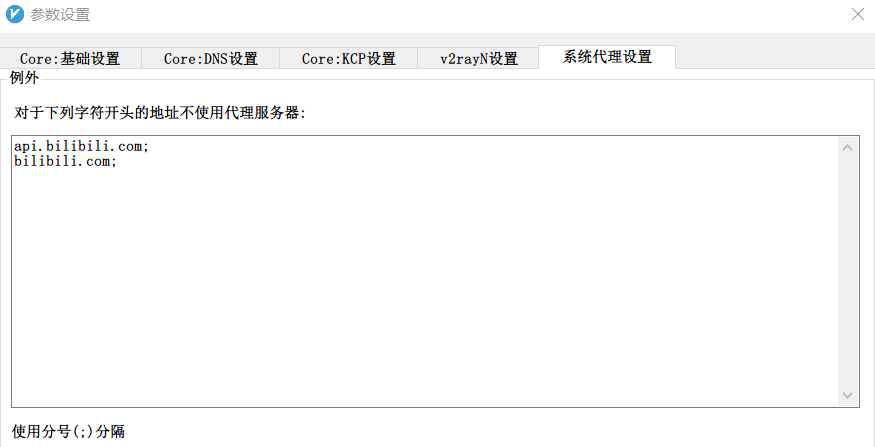
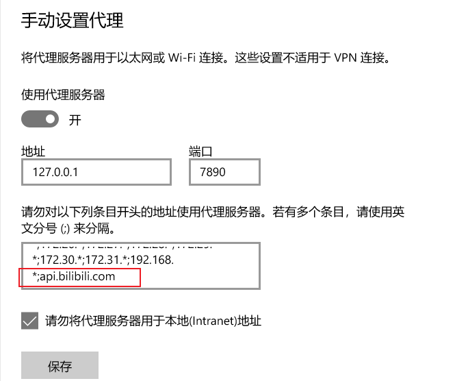

# 实现

## 准备mongodb数据库

- 安装mongodb 5.0+ server。这里使用 MongoDB 5.0.3 Community Standalone。
- 安装一个mongodb的GUI tool，方便客户端CRUD测试。这里使用MongoDB Compass 1.28.4。
    - 携带mongosh 命令行工具，方便早期测试实验。

在Windows 10 环境下，建议mongodb server安装为后台service，开机自启。

MongoDB CRUD Operations，可以参考[官方指南](https://docs.mongodb.com/upcoming/crud/)。

当确认以上都运行良好之后，可以继续python编写代码。

## 选择合适的 python driver

> 参阅 https://docs.mongodb.com/drivers/python/

官方推荐了两个选择： Motor 和 PyMongo。明显的区别是：

- Motor 是 Async driver。意味着和数据库交互时不会block python主程序。
- PyMongo 是 Sync driver。意味着和数据库交互时会block python主程序。

这里选择使用PyMongo，因为不需要考虑和web server的集成，可以不用考虑async context。

下面在windows 10环境下安装PyMongo。
> 如果网络下载缓慢，可以采取使用国内pip镜像源。

创建或者更新该文件 `C:\Users\{USER-NAME}\pip\pip.ini`

```
[global]
index-url = https://pypi.tuna.tsinghua.edu.cn/simple

[install]
trusted-host=mirrors.aliyun.com
```

执行安装 `python -m pip install 'pymongo[srv]'`

## 在开始测试python代码之前

### 如果你使用的是v2Ray
如果本地编程环境中使用了一些代理软件，例如v2Ray全局代理设置。请务必排除bilibili相关URL。


### 如果你使用的是clash


## 代码测试 PyMongo

需要你事先手动创建一个test的数据库，并创建collection user，添加一些dummy数据。

```python
import pymongo
import json

# Replace the uri string with your MongoDB deployment's connection string.
conn_str = "mongodb://127.0.0.1:27017/test"
# set a 5-second connection timeout
client = pymongo.MongoClient(conn_str, serverSelectionTimeoutMS=5000)
try:
    print(json.dumps(client.server_info()))
except Exception:
    print("Unable to connect to the server.")
```

关于 PyMongo的更多文档，查阅[PyMongo 3.12.1 Documentation](https://pymongo.readthedocs.io/en/stable/)

此外，可以测试更多pymongo API methods。熟悉API。