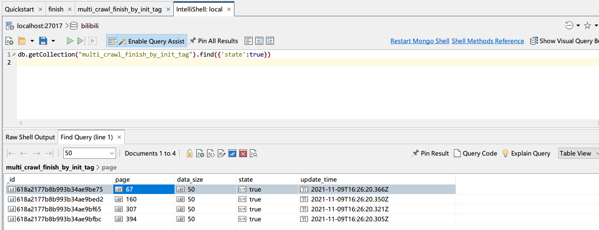
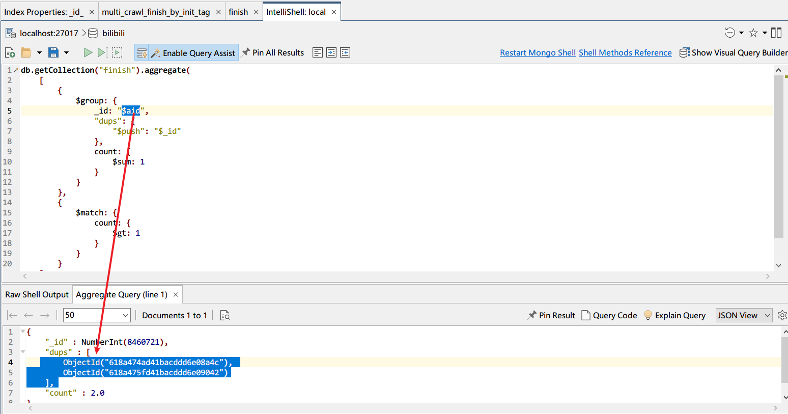
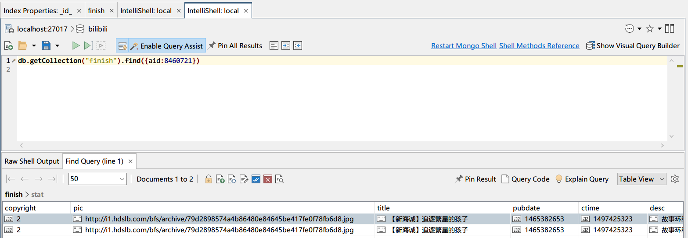

# some issues

## 爬虫进度-初始-标记法



## 重复的数据记录
find duplicate aid

``` json
[
  {
    $group: {
      _id: "$aid",
      "dups": {
        "$push": "$_id"
      },
      count: {
        $sum: 1
      }
    }
  },
  {
    $match: {
      count: {
        $gt: 1
      }
    }
  }
]
```





由于bilibili 本身API存在返回相同数据记录的可能。因此，对于aid千万不要先构建unique index以及使用upsert更新方式。

爬虫的数据一律直接insert，即使重复也先不处理。