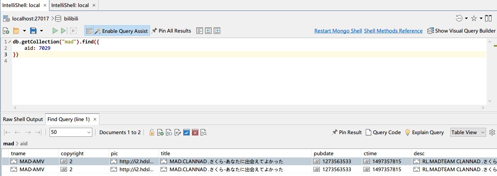

# some issues

## 重复的aid数据记录

```shell
db.getCollection("mad").aggregate(
    [
        {
            $group: {
                _id: "$aid",
                "dups": {
                    "$push": "$_id"
                },
                count: {
                    $sum: 1
                }
            }
        },
        {
            $match: {
                count: {
                    $gt: 1
                }
            }
        },
    ],
    {
        allowDiskUse: true
    }
)
```


通过aid查看mad:

- 记录条数为2的重复稿件例子



- 记录条数为3的重复稿件例子


## 总数据条数不完全一致

```
STATS: page_count=16593, total_count=829644
```

但是 mongodb 显示 829621。与bili API 相差23条。

问题在哪？

查询爬虫进度表：找出小于50的爬虫进度。


除了最后一页是23外，存在中间页数据数量不等于50的情况。这个很是意外。

说明bili API中间页数据不一定是充满50的。这会造成数量偏低。

---

使用聚集函数计算爬取总条数：


聚集函数计算的结果显示，爬虫的确只抓取了829621条数据。

于是我再次访问 bilibili API：

```
https://api.bilibili.com/x/web-interface/newlist?rid=24&type=0&pn=16593&ps=50
```

此时截图很有意思：


过了大约2分钟，我又再次访问上面的连接：


结论：

- bilibili API 中 page.count数值不可信，不可信，不可信。
- bilibili API 中 MAD稿件总数量会随时间波动，减少和增加都是可能的。因为投稿和删稿现象存在。
- 爬虫抓取机制没有问题。因为爬虫分页抓取的稿件数量累加完美=对应表的总条数。
- 由于所有稿件都是随时间变化者的，爬虫爬取完最后一页后，本质上数据就开始过时了。
- 爬虫只能得到爬虫时间范围内的数据情况。
- 爬虫可否后续同步数据呢？还不如重新抓取一次。MAD区开8线程也就1小时，perfect。理论上有效的线程数量越大，爬取效率越高。