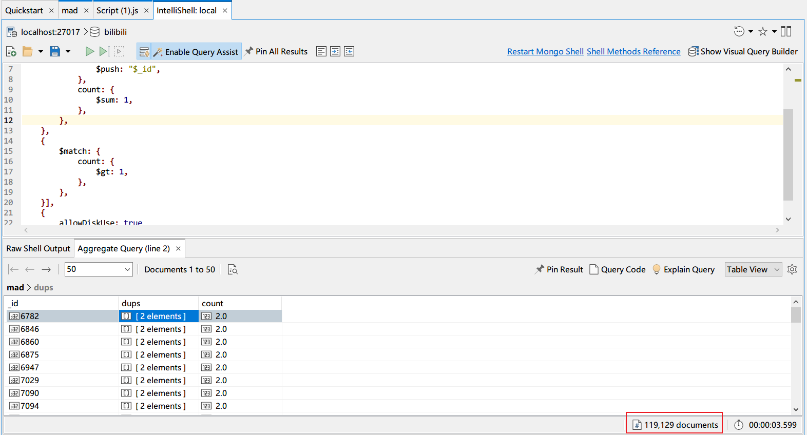
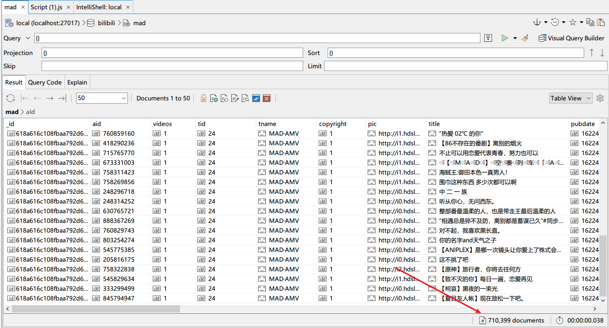

# MAD分区的统计

本文分析 mad 集合。

## 数据清洗

在开始数据分析之前，有必要进行数据清洗。这里，仅有数据去重：将重复aid的稿件删掉。

- MAD数据总条数为：829621
- aid不同的MAD数据条数：710399
  ```shell
  db.getCollection("mad").distinct('aid').length
  ```
- 相同的aid数量>1的数据条数：119129

  

  统计不同的数据类型：
    - count: 4+ 条数为 0
    - count: 3 条数为 93 => 93
    - count: 2 条数为 119036 => 119036
    - count: 1 条数为 591270 => 591270

是否满足：

```
0+93+119036+591270=710399? 正确！
```

### 编写删除重复的脚本

- mongoshell

``` js
use bilibili;
db.mad.aggregate([
    {
        $group: {
            _id: '$aid',
            dups: {
                $push: "$_id",
            },
            count: {
                $sum: 1,
            },
        },
    },
    {
        $match: {
            count: {
                $gt: 1,
            },
        },
    }],
    {
        allowDiskUse: true
    })
    .forEach(function (doc) {
        doc.dups.shift();
        db.mad.remove({ _id: { $in: doc.dups } })
    });
```

上面代码中：

```js
doc.dups.shift(); //从dups删除一个元素，目的是使得下面的删除for少执行一次。
db.mad.remove({_id: {$in: doc.dups}}) //删除重复元素，保留一个
```

还有更好的思路：bulk remove。关键是将要删除的aid收集到一个array中。
> https://docs.mongodb.com/manual/reference/method/Bulk.find.remove/

```js
var bulk = db.mad.initializeUnorderedBulkOp();
bulk.find({ /* here */}).remove();
bulk.execute();
```

- pymongo code

> TODO: pymongo bulk_remove()

最终，确认无误。


## 创建索引以加快查询速度

现在，为要经常SQL查询的field创建index，来加速搜索。类似于MySQL B+树。

这里，再次考察一个MAD稿件的信息,不关心的字段已经省略。

``` json
{ 
    "aid" : 760859160, <----------------------
    "copyright" : 1, 
    "title" : "“热爱 02℃ 的你”", 
    "pubdate" : 1622432943, 
    "desc" : "这首歌太上头了，热爱02℃的你。\n男声翻唱 《热爱105℃的你》超甜歌曲【KBShinya】 - (Av375805827)\nBGM：热爱105℃的你", 
    "duration" : 193, 
    "owner" : {
        "mid" : 51951877, <----------------------
        "name" : "还有sh-ui", 
        "face" : "http://i1.hdslb.com/bfs/face/58ef2ade9807116b7ddcdaa82fcd31143a85f0e0.jpg"
    }, 
    "stat" : {
        "view" : 500, 
        "danmaku" : 0, 
        "reply" : 20, 
        "favorite" : 29, 
        "coin" : 5, 
        "share" : 0, 
        "now_rank" : 0, 
        "his_rank" : 0, 
        "like" : 76, 
        "dislike" : 0
    }
}
```

需要建立index的字段有：aid（可以设置unique） 和 owner.mid（不要设置unique）。

万事俱备，开始使用 mongo 聚集函数来统计。

## 统计

### 思考关心的方面

这里，思考关于MAD的投稿信息：我们关心的是什么样的统计？例如，最高播放量？最高收藏量？BGM数据挖掘？

### 年度数据

以年度划分时间范围，例如2010年。

- 年度MAD总投稿量 => number
- 年度MAD日均投稿数 => number
- 年度每个月的MAD投稿数量 => number[]
- 年度MAD投稿数最高的up TOP 20 => mid[]
- 年度MAD投稿播放量TOP 20 => mad[]
- 年度MAD投稿弹幕数TOP 20 => mad[]
- 年度MAD投稿评论数TOP 20 => mad[]
- 年度MAD投稿收藏数TOP 20 => mad[]
- 年度MAD投稿硬币数TOP 20 => mad[]
- 年度MAD投稿分享数TOP 20 => mad[]
- 年度MAD投稿点赞数TOP 20 => mad[]
- 年度MAD**原创**投稿数/占比 => number,number
- 年度MAD**转载**投稿数/占比 => number,number
- 年度MAD**联合**投稿数/占比 => number,number
- 年度MAD投稿数最多的up TOP 20(~~生产队的驴~~) => mid[]
- 年度MAD投稿数平均时长(s): number
- 年度MAD投稿最具潜力的新up TOP 20: mid[]
- 年度MAD投稿的up等级分布情况：map<level,mid_distinct_count>

2009-2020,可以得出12个年度报告。2021先不考虑。

### 2009-现在的总数据

- MAD总投稿量 => number
- MAD日均投稿数 => number
- ~~每个月的MAD投稿数量 => number[]~~
- MAD投稿数最高的up TOP 20 => mid
- MAD投稿播放量TOP 20 => mad[]
- MAD投稿弹幕数TOP 20 => mad[]
- MAD投稿评论数TOP 20 => mad[]
- MAD投稿收藏数TOP 20 => mad[]
- MAD投稿硬币数TOP 20 => mad[]
- MAD投稿分享数TOP 20 => mad[]
- MAD投稿点赞数TOP 20 => mad[]
- MAD**原创**投稿数/占比 => number,number
- MAD**转载**投稿数/占比 => number,number
- MAD**联合**投稿数/占比 => number,number
- MAD投稿数最多的up TOP 20(~~生产队的驴~~) => mid[]
- MAD投稿数平均时长(s): number
- MAD投稿的up等级分布情况：map<level,mid_distinct_count>

### 东方Project凉了吗？

- 每年含有东方project相关tag的MAD稿件数量

> 需要补充抓取tag

### BGM数据挖掘

挖坑。

