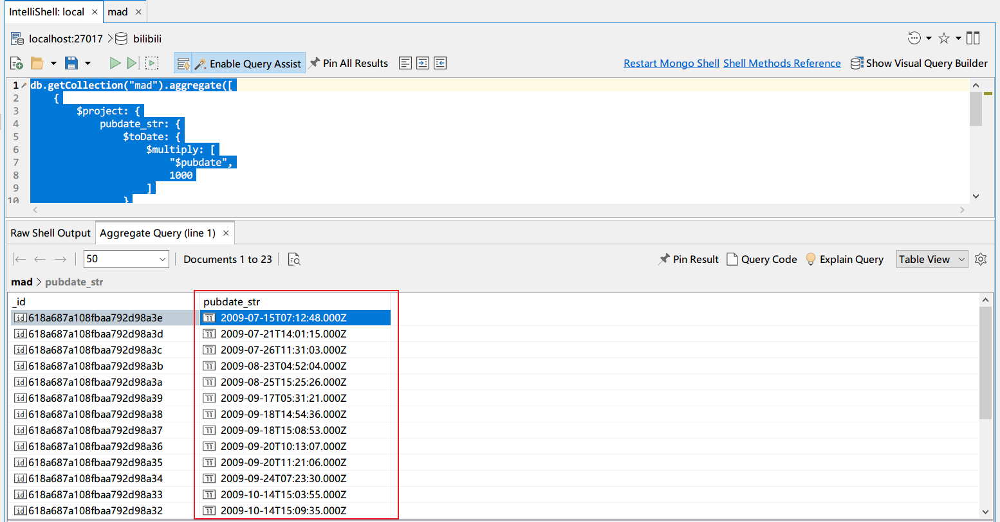

# mad-2009

## try: timestamp to date

文档：

```json
[
  {
    "unix_timestamp": 1635846284
  }
]
```

Query:

```js
db.collection.aggregate([
    {
        $project: {
            ts: {
                $toDate: {
                    $multiply: [
                        "$unix_timestamp",
                        1000
                    ]
                }
            }
        }
    }
])
```

output:

```js
[
    {
        "_id": ObjectId("5a934e000102030405000000"),
        "ts": ISODate("2021-11-02T09:44:44Z")
    }
]
```

## find mad 2009

```js
db.getCollection("mad").aggregate([
        {
            $project: {
                pubdate_str: {
                    $toDate: {
                        $multiply: [
                            "$pubdate",
                            1000
                        ]
                    }
                }
            }
        },
        {
            $match: {
                pubdate_str: {
                    $gte: ISODate("2009-01-01T00:00:00.000Z"),
                    $lt: ISODate("2010-01-01T00:00:00.000Z"),
                }
            }
        },
        {$sort: {pubdate_str: 1}}
    ],
    {
        allowDiskUse: true
    }
)
```

结果截图如下：


看起来效果不错。这样，我们就得到了2009年度所有MAD，即使很简陋。

## 朝着目标前进

- 年度MAD总投稿量 => number
- 年度MAD日均投稿数 => number
- 年度每个月的MAD投稿数量 => number[]
- 年度MAD投稿数最高的up TOP 20 => mid[]
- 年度MAD投稿播放量TOP 20 => mad[]
- 年度MAD投稿弹幕数TOP 20 => mad[]
- 年度MAD投稿评论数TOP 20 => mad[]
- 年度MAD投稿收藏数TOP 20 => mad[]
- 年度MAD投稿硬币数TOP 20 => mad[]
- 年度MAD投稿分享数TOP 20 => mad[]
- 年度MAD投稿点赞数TOP 20 => mad[]
- 年度MAD原创投稿数/占比 => number,number
- 年度MAD转载投稿数/占比 => number,number
- 年度MAD联合投稿数/占比 => number,number
- 年度MAD投稿数最多的up TOP 20(生产队的驴) => mid[]
- 年度MAD投稿数平均时长(s): number
- 年度MAD投稿最具潜力的新up TOP 20: mid[]
- 年度MAD投稿的up等级分布情况：map<level,mid_distinct_count>

### 年度MAD总投稿量

```js
db.getCollection("mad").aggregate([
        {
            $project: {
                pubdate_str: {
                    $toDate: {
                        $multiply: [
                            "$pubdate",
                            1000
                        ]
                    }
                }
            }
        },
        {
            $match: {
                pubdate_str: {
                    $gte: ISODate("2009-01-01T00:00:00.000Z"),
                    $lt: ISODate("2010-01-01T00:00:00.000Z"),
                }
            }
        },
        {
            $sort: {
                pubdate_str: 1
            }
        },
        {
            $count: "count"
        }
    ],
    {
        allowDiskUse: true
    }
)
```

23

### 年度MAD日均投稿数

23/2009的年数=？不忍直视

### 年度每个月的MAD投稿数量
> TODO: use $group by prefix 2009-01