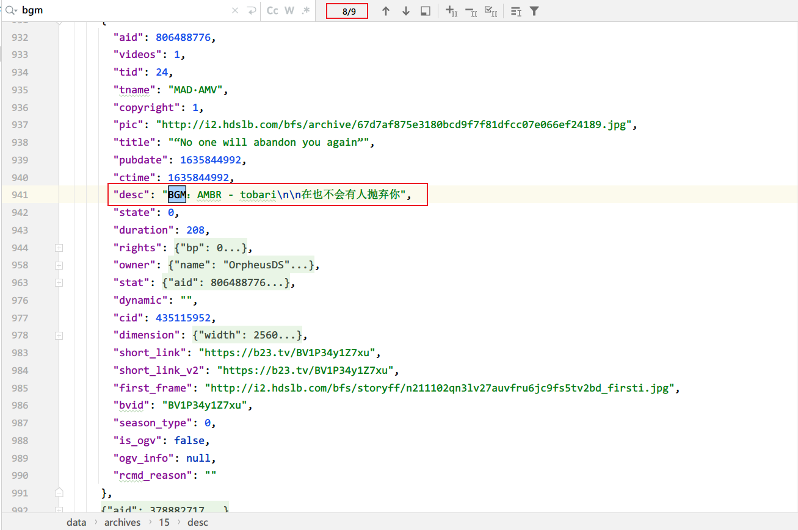

# 分析数据

## BGM 示例

TODO:列举BGM的文本模式。

## BGM的获取逻辑
1.理想的状态下， BGM信息存放于desc，或者desc_v2.raw_text字段中。

那么，优先从以上字段中寻找关于“BGM”的单词，提取出来。

2.当以上情况下，不存在BGM相关信息时，可以考虑从**视频评论**，或者**弹幕**中进行提取。这一步要处理的数据量会显著增加。

3.当以上情况都不存在BGM信息时，可以考虑人工介入。人力资源非常昂贵，所以这一步可以考虑以下方式：
  - 利用类似captcha认证的方式，制作网站，开放人工标注页面，引导MAD圈路人进行标注。然而人工审核。
  - 利用video to music 这类反向搜索引擎，进行解析。然后人工审核。