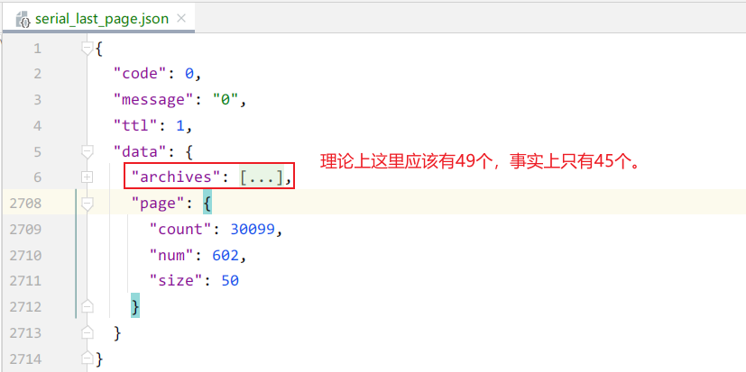

# bilibili api

## 投稿时间排序-分页搜索

```http request
https://api.bilibili.com/x/web-interface/newlist?rid=24&type=0&pn=1&ps=20&jsonp=jsonp
```

- pn 页码
- ps 上限为50。默认为20。

实际上，b站MAD区最早稿件时间为 2009-07-15 15:12:48。那么 [2009-07-15, 2021-11-4]这个时间区间，大约12年左右，一共12*365=4380天。
80W/4380约等于183，也就是平均每天大约200份稿件的数量级。

### 避免重复记录插入数据库

问题描述：分析爬虫过程中，页数推移会导致部分页面抓取的数据会发生重复。

举例：开始时，假设页数总数为40000，每页20条数据，刚好800000条数据。 数据分布：

```
A1...A20|A21...A40|A41-...-A800000
```

- 爬虫抓取第1页。爬虫休息一下。
- b站数据更新，现在总页数变为40001,，添加数据5条，为N1...N5。

那么数据分布现在是：

```
N1...N5 A1...A15|A16...A35|A36...A80000
```

- 此时爬虫开始抓取第2页，也就是A16...A35。这和之前抓取的第一页有重叠：

```
A1.........................A20.A21..............................A41
|-----------------------------|<---------------------------------->|
                                       理论上要抓取的第2页

N1...N5.A1..................【A16......A20】.A21....................A35.........A41
|---------------------------|<---------------------------------->|
                                        当前抓取第2页
```

- 重叠部分为A16...A20。一共就是5个稿件，原因就是因为N1...N5这5个新稿件的发布对数据部分产生推移。

**上面只是一个例子推演，新稿件的发布数量以及发布时间都是不可知的。绝不能对此有所假设。**

明白这个现象的存在性非常必要。此时可以考虑如何避免数据库插入重复数据。这个逻辑可以在应用层，或者在数据库层进行处理。

在应用层主动筛选抛弃：

1. 应用层代码在抓取当前页数据后，保存这一页全部视频的ID到一个id_array中。例如，[A1...A20]。
2. 抓取下一页后，将抓取到的视频id 列表和这个id_array比较，如果已经存在，那就抛弃这条数据。插入剩余数据到数据库后，更新id_array。 以此类推。

或者在数据库层挑选插入：

1. 应用层不去关心数据有没重复，使用mongodb的upsert功能，设置upsert为true。 查询特定数据，如果已存在，那就不插入，否则就插入该条数据。这个机制，依赖的是数据库的挑选插入功能。

或者利用数据库的唯一索引进行暴力约束：

1. 因为视频ID必然唯一。那么定义schema model时设置视频ID为unique。这样，重复数据是无法插入的。这是数据库系统规范对你的承诺。

这三种方式都是可行的。基于简单考虑，使用2+3的策略。

- 使用【当不存在就新增，存在则更新】的批量更新策略。
- 对数据库模型定义添加视频ID唯一的索引约束。(可选)

### 最后一页

这里以另外一个分区的API为例，因为这个分区总稿件数较少。 番剧主分区-连载动画：

```
https://api.bilibili.com/x/web-interface/newlist?rid=33&type=0&pn=602&ps=50
```

最后一页的数据截图：



这个现象说明：最后一页的数据长度可能和page.count不对应。这个估计是bilibili cache的问题。

### 爬取超过最后一页

```http request
https://api.bilibili.com/x/web-interface/newlist?rid=24&type=0&pn=50000&ps=20
```

pn=50000&ps=20 条件下，pn=50000大于目前数据总数。返回的结果为：

```json
{
  "code": 0,
  "message": "0",
  "ttl": 1,
  "data": {
    "archives": [
    ],
    "page": {
      "count": 0,
      "num": 50000,
      "size": 20
    }
  }
}
```

那么程序需要进行archives的长度>0判断。

### archive 格式

``` json
"stat": {
    "aid": 721418604,
    "view": 0, 播放
    "danmaku": 0, 弹幕
    "reply": 0, 回复
    "favorite": 0, 收藏
    "coin": 0, 硬币
    "share": 0, 分享
    "now_rank": 0, 目前排名
    "his_rank": 0, 历史最高排名
    "like": 0, 点赞
    "dislike": 0 默认为0
}
```

这个API返回的数据中含有很全面的视频统计信息。

## 视频热度排序-按日期范围搜索

这个api非常好用，能够避免分页搜索随时间推移产生的重复问题。

```
https://s.search.bilibili.com/cate/search?main_ver=v3&search_type=video&view_type=hot_rank&order=click&copy_right=-1
&cate_id=24&page=1&pagesize=20&jsonp=jsonp&time_from=20211103&time_to=20211103
```

例如 time_from=20211103&time_to=20211103 表示20211103这天的MAD稿件。

返回的结果中，有三个重要字段。

- "numPages": 3,
- "numResults": 53,
- "pagesize": 20,

如果pagesize为20，稿件数为53。则会分为3页，分别是20,20,13。

### archive 格式

``` json
{
  "senddate": 1635874522,
  "rank_offset": 2,
  "tag": "名侦探柯南,剪辑,灰原哀,新人向,MAD.AMV,您的剪辑作业已提交",
  "duration": 102,
  "id": 848891453,
  "rank_score": 1559,
  "badgepay": false,
  "pubdate": "2021-11-03 01:35:22",
  "author": "kylin小王几",
  "review": 9, <-------------------------------
  "mid": 179265650,
  "is_union_video": 0,
  "rank_index": 0,
  "type": "video",
  "arcrank": "0",
  "play": "1559", <---------------------------------
  "pic": "//i0.hdslb.com/bfs/archive/e4c74adc6d157adee097a35ea55bb702a162ff15.jpg",
  "description": "哀酱的素材多到根本剪不完！\n从娘胎起就是哀吹的小玲同学来报到啦\nbgm： say so",
  "video_review": 0,
  "is_pay": 0,
  "favorites": 18, <--------------------------
  "arcurl": "http://www.bilibili.com/video/av848891453",
  "bvid": "BV1cL4y1q7Aq",
  "title": "哀酱也想要say so~"
}
```

这里，只有review（评论），play（播放），favorites（收藏）字段。


