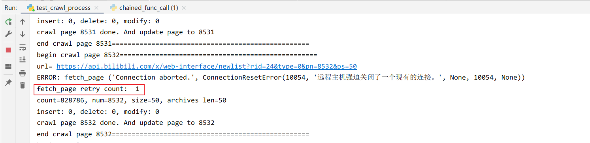

# 处理requests的异常

- [x] 发生吊起主动放弃，然后重试
- [x] 发生错误被动放弃，然后重试

## hang 
保持连接(hang)但无响应/无错误，~~情况渐渐焦灼~~。

> The default timeout is None, which means it'll wait (hang) until the connection is closed.

- ConnectTimeout
- ReadTimeout

```python
# timeout=5，只有一个值，那么连接和读超时都是5秒
r = requests.get(url, timeout=5)

# timeout=(5, 30)，连接超时为5，读超时为30
r = requests.get(url, timeout=(5, 30))
```

举例：
````bash
begin crawl page 15169==================================================
url= https://api.bilibili.com/x/web-interface/newlist?rid=24&type=0&pn=15169&ps=50
...
````
此时HTTP连接已经建立，但是连接没有报错，也拿不到正常的数据响应。就这样一直吊着，卡在了“Read”这一步。

这种情况需要一种主动放弃的策略，具体就是：
```
服务器：我很慢，你忍一下。
python requests：你这么慢，我不等你了，连接的小船说翻就翻。
```
解决方法：requests 请求中定义一个超时参数，例如最多等10秒，10秒给不了响应我就摊牌了。
```
r = requests.get(url, timeout=10)
```

## 错误
### ProxyError

```bash
HTTPSConnectionPool(host='api.bilibili.com', port=443):
Max retries exceeded with url: /x/web-interface/newlist?rid=24&type=0&pn=1&ps=20
(Caused by ProxyError('Cannot connect to proxy.', OSError(0, 'Error')))
```

本地代理错误。请设置本地电脑的代理，跳过api.bilibili.com这个host。也就是：
**不要对api.bilibili.com使用代理。**

### TimeoutError

```bash
('Connection aborted.', TimeoutError(10060, '由于连接方在一段时间后没有正确答复或连接的主机没有反应，
连接尝试失败。', None, 10060, None))
```

### ConnectionResetError

```bash
ERROR: fetch_page ('Connection aborted.', ConnectionResetError(10054, 
 '远程主机强迫关闭了一个现有的连接。', None, 10054, None))
```

## 自定义重试机制

上面分析了一些异常情况，不管是主动还是被动放弃，结果都是当前请求失败了。

为了构建可以容错的强大爬虫机制，需要采取自定义的重试机制。下面是伪代码。

``` python
def fetch_page(url, retry_max=3):
    retry_count = 0
    retry_max = retry_max

    while retry_count <= retry_max:
        try:
            # make http request and return value
            return make_http_request()    
        except Exception as e:
            time.sleep(3)

            retry_count += 1
            print('fetch_page retry count: ', retry_count)

    return None
```

- 变量 retry_count 表示当前重试的次数。
- retry_max 为最大重试次数，提取为函数参数方便配置。
- 每次重试之前，稍微等待3秒，避免过于暴力的重试。

验证是否真实可用。图中在抓取8532页时发生报错，retry机制完美解决这个问题。程序没有中断。
